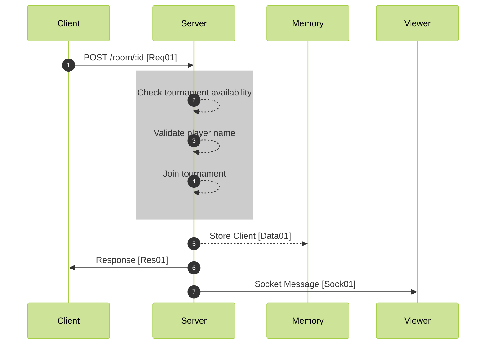

## Player Joining room

```mermaid
%%{
  init: {
    'theme': 'forest',
    'themeVariables': {
      'primaryColor': '#BB2528',
      'primaryTextColor': '#fff',
      'primaryBorderColor': '#7C0000',
      'lineColor': '#F8B229',
      'secondaryColor': '#006100',
      'tertiaryColor': '#fff'
    }
  }
}%%
sequenceDiagram
    autonumber
    participant C as Client
    participant S as Server
    participant M as Memory
    participant V as Viewer

    C->>S: POST /room/:id [Req01]

    rect rgba(0,0,0,0.2)
        S-->>S: Check tournament availability
        S-->>S: Validate player name
        S-->>S: Join tournament
    end

    S-->>M: Store Client [Data01]
    S->>C: Response [Res01]
    S->>V: Socket Message [Sock01]
```

---
