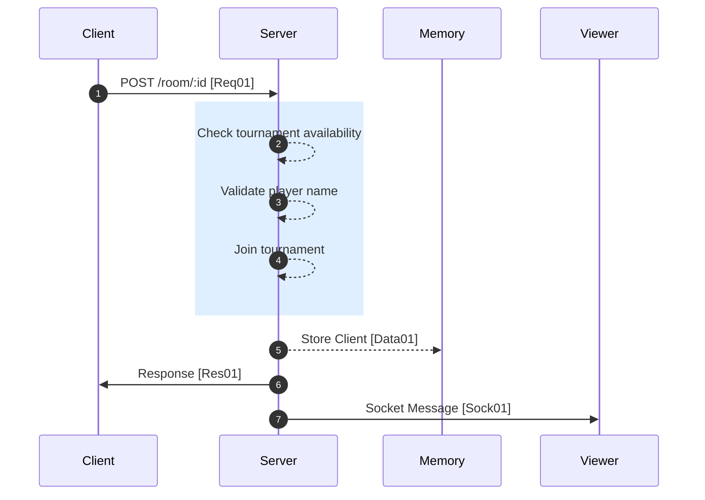

## Player Joining room

```mermaid
sequenceDiagram
    autonumber
    participant C as Client
    participant S as Server
    participant M as Memory
    participant V as Viewer

    C->>S: POST /room/:id [Req01]

    rect rgba(191, 223, 255, 0.5)
        S-->>S: Check tournament availability
        S-->>S: Validate player name
        S-->>S: Join tournament
    end

    S-->>M: Store Client [Data01]
    S->>C: Response [Res01]
    S->>V: Socket Message [Sock01]
```

---
